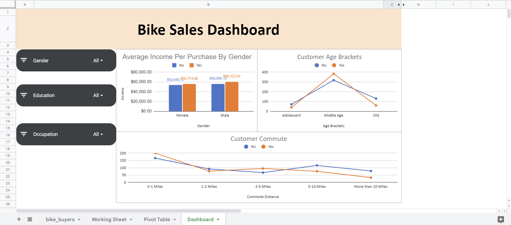
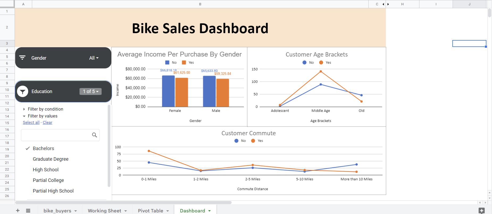
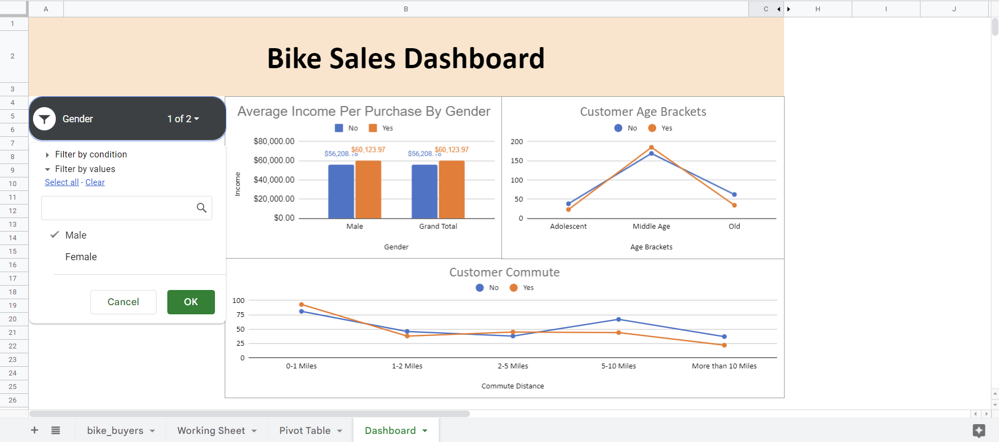
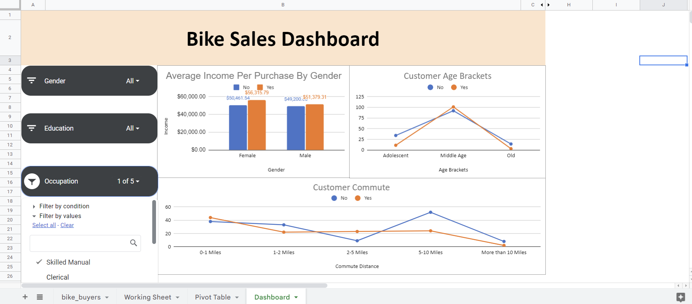

# Bike Sales Dashboard Using Google Sheets
## Goal
The goal for this project was to provide business insights based on bike sales data. The dashboard included in this project was created inside of google sheets.

## Data Understanding
The data for this project can be downloaded from this repository:
* [Data](https://github.com/AlexTheAnalyst/Excel-Tutorial/blob/main/Excel%20Project%20Dataset.xlsx)

Or it could be downloaded from this repository file titled bike_sales_data.

The dataset contained:
* 1027 rows 
* 12 columns

Some of the values in the dataset had to be modified for the sake of interpretability. However, it did not affect the integrity of the data. One of the changes that were made in the dataset was the name of the values in the Marital Status column and the Gender column. Both of those columns contained "M" and as to not cause confusion, the "M" in the Marital Status column was changed to "Married" and in the Gender column, it was changed to "Male". Since those values were changed, the other values were included in the change. "S" in the Marital Status column was changed to "Single" and "F" in the Gender column was changed to "Female".

The Age column also had to be modified into bins of information compared to individual ages. It makes for an easier and more informative visualization. The bins were categorized as:

* Ages below 31 were categorized as "Adolescence".
* Ages between 31 and 54 were categorized as "Middle Aged". 
* Ages above 54 were categorized as "Old".  

The last column to be modified was the commute distance column. The value "10+ miles" had to be changed to "More than 10 miles" due to pivot table organization. When the value name was not change, it did not order properly into descending order which in turn affected the visualization later produced. 

## Dashboard
After the needed changes to data, the Dashboard was successfully produced. This was the result of the finished dashboard:



This dashboard includes 3 visualizations. The chart titled "Average Income Per Purchase by Gender" includes a breakdown of the average income per gender of people who did or did not purchase bikes. According to the dashboard, both men and women who had higher income purchased bikes more than those who did not.

The chart titled "Customer Age Brackets" includes a breakdown of which age group made purchases of bikes. TRhe information shows that the age bracket that purchase more bikes than not was the middle aged customer. The Adolescent and Old customers did not buy more bikes than not.

The final chart titled "Customer Commute" includes information on the sales of bikes based on the distance the customer regularly commutes. The chart shows that longer distance does not necessary equal more bike purchases. Customers who regularly travel between 2-5 miles bought more bikes on average compared to people who travel 5 or more miles.

## Slicer
A slicer was used to be able to make the dashboard more dynamic. A slicer including Gender, Education and Occupation were included. Depending on the selections in the sliders, the information can change.

<b>Example 1: Education (Bachelors)</b>


<b>Example 2: Gender (Male)</b>


<b>Example 3: Occupation (Skilled Manual)</b>


Each dashboard changed dynamically based on the column chosen in the slicer. As data gets added to the google sheet, the dashboard will automaticaly update and reflect the changes visually.

## References
[Full Project in Excel | Excel Tutorials for Beginners](https://www.youtube.com/watch?v=opJgMj1IUrc) 


## Repository Structure

```
├── images
├── README.md
├── bike_sales_dashboard
└── bike_sales_data
```

